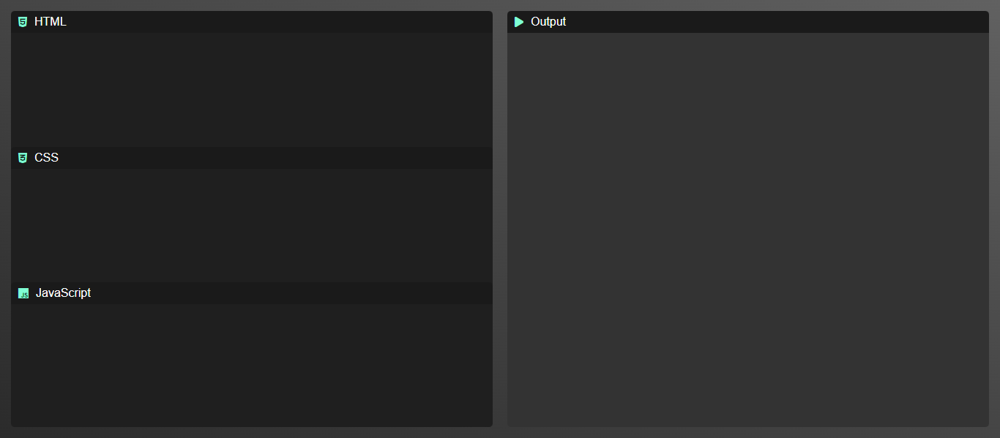

# Code Editor Project

This project is a simple **HTML/CSS/JavaScript Code Editor** that lets you write and preview code in real-time.

## 🚀 Features
- Live preview of HTML, CSS, and JavaScript
- Separate editors for each language
- Output displayed in an iframe
- Clean and responsive layout
- Uses FontAwesome icons for a modern interface

## 📁 Project Structure
```
├── index.html      # Main UI layout
├── style.css       # Styles for the editor interface
└── script.js       # Live preview functionality
```

## 🖼️ Screenshot

```

```

## 🛠️ How It Works
- You type code into the HTML, CSS, and JS textareas.
- The `run()` function inside `script.js` updates the iframe:
  - Inserts HTML into the iframe’s body
  - Appends CSS inside a `<style>` tag
  - Executes JavaScript using `eval()` inside the iframe

## 📌 Usage
Just open **index.html** in your browser and start writing code.

## 📄 License
This project is free to use and modify as you like.

---
If you want, I can also:
- Add a screenshot image for you
- Improve the design
- Host this on GitHub or make a better README

